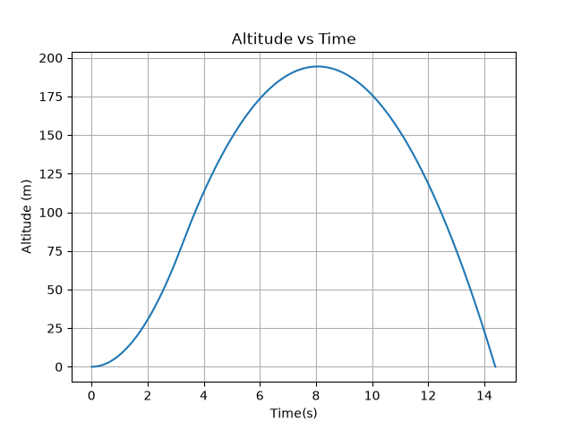
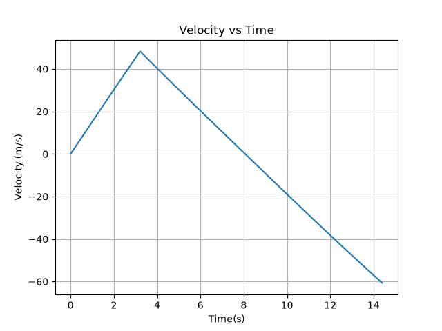
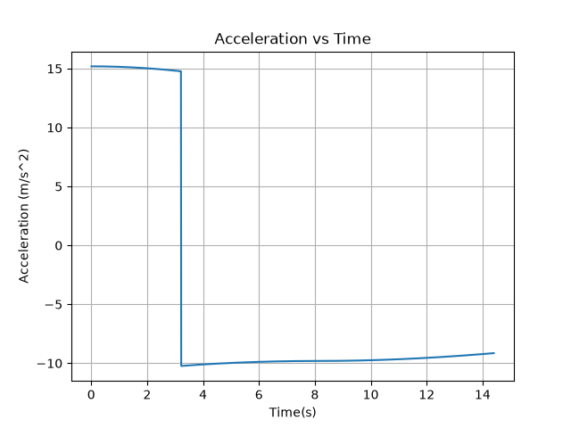

# 🚀 One-dimensional Rocket Flight Simulator

This project is a one-dimensional rocket flight simulator written in Python that models the vertical ascent and descent of a rocket using classical mechanics. The simulator calculates and visualizes the rocket's altitude, velocity, and acceleration throughout the duration of the flight while accounting for thrust, gravity, and aerodynamic drag.

---

## Features

- Simulates one-dimensional vertical rocket flight
- Models thrust, gravity, and aerodynamic drag
- Calculates altitude, velocity, and acceleration throughout the flight
- Simulates powered ascent, coast, apogee, descent, and landing
- Calculates impact velocity
- Generates altitude, velocity, and acceleration plots
- Handles failed-launch scenarios
- Modular Python architecture for future expansion

---

## Project Structure

```text
rocket-flight-simulator/
│
├── constants.py        # Physical constants used throughout the simulation
├── environment.py      # Atmospheric and environmental models
├── forces.py           # Thrust, weight, drag, net force, and acceleration calculations
├── main.py             # Entry point for running the simulator
├── rocket.py           # Rocket class and vehicle properties
├── simulation.py       # Flight simulation engine
├── figures/            # Generated simulation plots
├── requirements.txt    # Python dependencies
├── README.md           # Project documentation
└── .gitignore          # Git ignore 
configuration
├── LICENSE             # MIT License
```


---

## Physics Model

The simulator models the rocket's motion using classical mechanics and Newton's Second Law.

### Newton's Second Law

\[
a = Fnet / m
\]

where

- **a** = acceleration (m/s²)
- **Fₙₑₜ** = net force acting on the rocket (N)
- **m** = rocket mass (kg)

---

### Net Force

The net force acting on the rocket is calculated from the sum of thrust, weight, and aerodynamic drag.

\[
F_net = F_thrust + F_weight + F_drag
\]

---

### Weight

The gravitational force acting on the rocket is

\[
F_weight = -mg
\]

where

- **m** = rocket mass (kg)
- **g** = gravitational acceleration (9.81 m/s²)

---

### Aerodynamic Drag

The drag force magnitude is calculated using

\[
F_drag = ½ρCdAv²
\]

where

- **ρ** = air density (kg/m³)
- **Cₙ** = drag coefficient
- **A** = frontal area (m²)
- **v** = rocket velocity (m/s)

The direction of the drag force is always opposite the direction of motion.

---

### Frontal Area

The frontal area of the rocket is calculated from its diameter.

\[
A = π(d/2)²
\]

where

- **d** = rocket diameter (m)

---

### Thrust Model

Version 1 assumes constant thrust during the motor burn.

\[
If t < t_burn

    F_thrust = T

If t ≥ t_burn

    F_thrust = 0
\]

where

- **T** = rocket thrust (N)
- **t₍burn₎** = motor burn time (s)

---

### Numerical Integration

The simulator advances the rocket's state using a fixed time step.

Velocity:

\[
v_new = v_old + aΔt
\]

Altitude:

\[
h_new = h_old + v_newΔt
\]

Time:

\[
t_new = t_old + Δt
\]

This implementation uses a semi-implicit Euler integration method.

---
## Installation

1. Clone the repository.

```bash
git clone https://github.com/prophetteengineering/rocket-flight-simulator.git
```

2. Navigate to the project directory.

```bash
cd rocket-flight-simulator
```

3. Install the required Python dependencies.

```bash
pip install -r requirements.txt
```

---

## Usage

Run the simulator with:

```bash
python main.py
```

The simulator will:

- Simulate the rocket's vertical flight.
- Display a flight summary in the terminal.
- Generate altitude, velocity, and acceleration plots.
- Save the generated plots to the `figures/` directory.
---

## Example Results

### Flight Summary

```text
Rocket Flight Summary
----------------------
Rocket Name: Test Rocket
Flight Time: 14.40 s
Maximum Altitude: 194.34 m
Maximum Velocity: 48.31 m/s
Maximum Acceleration: 15.19 m/s²
Impact Velocity: -60.71 m/s
```

### Altitude vs Time



### Velocity vs Time



### Acceleration vs Time



## Future Improvements

- User-defined rocket parameters
- Variable atmospheric density
- Variable mass during propellant burn
- Improved thrust curves
- Multi-stage rocket support
- Two-dimensional trajectory simulation
- Guidance, Navigation, and Control (GNC)

---

## License

This project is licensed under the MIT License. See the [LICENSE](LICENSE) file for details.